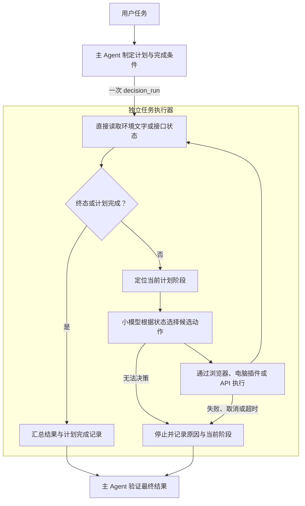

# 任务接管：大模型规划，小模型执行

主 Agent 一次性交付目标、执行计划和完成条件。执行器直接读取浏览器、桌面或接口状态，调用
Decision Provider 选择动作，执行并推进计划。主 Agent 不参与中间循环，结束后验收结果。
单次决策仍使用 `decision_decide`；完整任务使用 `decision_run`，独立程序使用 `runTask()`。



执行计划由调用方提供，不写死在插件里。循环和动作映射是程序逻辑；当前页面该点哪个元素由
决策模型选择。它执行已规划的流程，不在执行中调用主模型重新规划。

## 1. 浏览器或电脑：直接执行计划

以下是交给 `decision_run` 的参数。页面文字和完成标记需要由规划方按实际网站填写：

```json
{
  "environment": "browser",
  "objective": "完成培训答题，返回最终成绩。",
  "plan": [
    {
      "id": "enter",
      "objective": "从后台首页进入培训答题页面。",
      "completion": { "path": "main", "includes": "第 1 题" }
    },
    {
      "id": "answer",
      "objective": "根据题目选择答案并提交；出现下一题时点击下一题，直到全部答完。",
      "completion": { "path": "main", "includes": "最终成绩" }
    }
  ],
  "maxSteps": 300,
  "maxDurationMs": 600000
}
```

每个阶段必须包含唯一 `id`、`objective` 和 `completion`；可以提供阶段自己的 `maxSteps`。
`completion` 通过点分路径读取**观察状态**，并且只使用 `equals` 或 `includes` 中的一种：

- 浏览器正文：`path: "main"`；URL：`path: "url"`。
- 电脑无障碍树文字：`path: "text"`；应用由 computer adapter 的 `app` 配置指定。
- 自定义接口：例如 `{ "path": "session.finished", "equals": true }`。

运行时根据观察值推进阶段，并把“当前阶段目标 + 整体目标”交给小模型。达到最后一个阶段的
完成条件后返回。没有阶段计划时，浏览器/电脑任务必须单独传 `completion`，或由适配器实现
`isDone()`。接口环境可以通过 `done` 报告终态，因此计划可以省略。

浏览器和电脑读取各自插件提供的文字元素。两者都直接经过 DSH 工具执行链，保留发起任务的
Agent 身份、权限检查、取消信号和调用父子关系。浏览器仍需选定目标页面，电脑仍需配置目标
应用；插件不会凭目标描述自动发现任意后台或登录账户。

## 2. 外部游戏或系统：提供环境接口

任务参数使用 `endpoint`，与 `environment` 二选一：

```json
{
  "endpoint": "http://127.0.0.1:8080/environment",
  "objective": "完成这一局并返回最终得分。",
  "maxSteps": 1000
}
```

环境服务实现下面两个接口。决策执行器主动调用它们，主 Agent 无需中转数据。协议标识为
`dsh-environment/v1`，类型定义在 `src/environments/http/adapter.ts`。

### GET /environment/state

返回当前快照：

```json
{
  "protocol": "dsh-environment/v1",
  "environmentId": "training",
  "episodeId": "attempt-123",
  "revision": "4",
  "state": { "question": "2 + 3 = ?", "answered": 0 },
  "candidates": [
    { "id": "answer-4", "description": "选择答案 4" },
    { "id": "answer-5", "description": "选择答案 5" }
  ],
  "done": false
}
```

`state` 是字符串或 JSON 对象。非终态需要 1–64 个合法候选，id 唯一；每个候选包含 `id`、
`description`，可带 `metadata` 和 `risky`。`environmentId`、`episodeId`、`revision`
都是非空字符串：分别标识环境、本次任务实例、当前状态版本。执行器在一次任务中固定前两项，
遇到切换会停止。

### POST /environment/action

执行器根据选中的候选发送：

```json
{
  "protocol": "dsh-environment/v1",
  "actionId": "a-unique-uuid",
  "environmentId": "training",
  "episodeId": "attempt-123",
  "revision": "4",
  "candidateId": "answer-5"
}
```

服务端必须在应用动作时校验环境、任务实例、版本和当前允许的候选。过期请求用 HTTP 409
拒绝；同一个 `actionId` 与同一请求重复到达时，返回已记录的响应，不再次执行。相同 id 携带
不同请求也应拒绝。客户端不自动重试动作；网络异常无法保证动作未生效。

成功响应携带动作完成后的完整快照，作为下一次决策的输入：

```json
{
  "ok": true,
  "observation": {
    "protocol": "dsh-environment/v1",
    "environmentId": "training",
    "episodeId": "attempt-123",
    "revision": "5",
    "state": { "answered": 1, "score": 100 },
    "candidates": [],
    "done": true,
    "result": { "score": 100, "outcome": "passed" }
  }
}
```

`done: true` 表示环境已经终止，可能成功，也可能失败；`result` 是环境给出的结果，不能由
模型声称“已完成”来替代。终态允许候选为空。业务拒绝也可以返回
`{ "ok": false, "message": "原因" }`，执行器会停止。

HTML 游戏需要把实际运行状态接到可访问的服务或桥接层。单独声明 `window.game` 还不是 HTTP
端点。普通 DOM 网站可以直接选浏览器适配器，无须为了接入而重写网站。

## 3. 脱离 DSH 使用同一执行器

```js
import { createDecisionLayer, HttpEnvironmentAdapter } from 'dsh-decision-engine/embed'

const decisions = createDecisionLayer({ laya: { modelDir: '/path/to/bundle' } })
try {
  const outcome = await decisions.runTask({
    environment: new HttpEnvironmentAdapter({ endpoint: 'http://127.0.0.1:8080/environment' }),
    objective: '完成任务，返回最终结果。',
    // plan: [...],                         // 与工具相同的计划阶段
    config: { maxSteps: 1000, maxDurationMs: 600000 },
    // signal: controller.signal,
  })
  console.log(outcome.status, outcome.result, outcome.finalState)
} finally {
  await decisions.dispose()
}
```

`CustomEnvironmentAdapter` 也可以直接交给 `runTask`。它可通过 `isDone(state)` 判断终态，
通过 `result(state)` 提供成绩或完成结果。HTTP 与进程内接口复用同一个运行时。

## 4. 返回、预算与运行边界

`decision_run` 返回 `taskId`、`status`、`environment`、`steps`、`durationMs`、环境的
`result`、最后观察到的 `finalState`。有计划时还返回 `completedPlanSteps`；未全部完成时
返回 `activePlanStep`。`needs_escalation` 带 `reason`、`guidance`；执行中取消或超时可能
携带 `actionMayHaveExecuted`，提示验收方先核实现场。

默认最多 1000 次动作、10 分钟；DSH 工具允许最多 30 分钟。仍有单次观察、执行和模型超时。
整任务允许重复选择相同动作，例如持续向右或连续点“下一题”；连续三次观察不到状态变化则
停止。SDK 可以通过运行时配置调整这些阈值，或将 `noProgressLimit` 设为 0 关闭该检测。

同一运行时不允许两个任务同时驱动相同环境 id。取消和超时会停止后续决策与动作；不能强制
撤销已经发往网站或电脑的操作，仍在执行的调用结束前会保留环境占用。这不是跨进程、跨插件
或对人工操作的全局锁，接口服务仍须做版本校验。

任务执行目前保持在一个 DSH 工具调用或 SDK Promise 内；没有每步主模型调用，也没有持久化
后台任务进程。关闭宿主不会保留任务。任意阶段失败会交回结果，不会自动调用主模型修复计划。

## 5. 可运行示例与验证范围

在源码仓库中运行：

```bash
npm run build
node examples/demo-takeover.mjs
node examples/demo-takeover.mjs --serve
```

第一条示例用规则 provider 自动完成一个带 HTML 界面的接口游戏，并打印结果。`--serve`
保持服务运行，打印页面地址与 `decision_run` 参数，供 DSH 配置的 provider 执行。
安装好可选 Laya SDK 和本地模型后，可用
`LAYA_MODEL_DIR=/path/to/bundle node examples/demo-takeover.mjs --laya` 接入真实模型。

规则 provider 和测试里的脚本 provider 验证流程交付、阶段推进、直接读写和最终结果回传；
它们不证明真实模型的答题正确率或任意网站上的执行能力。
