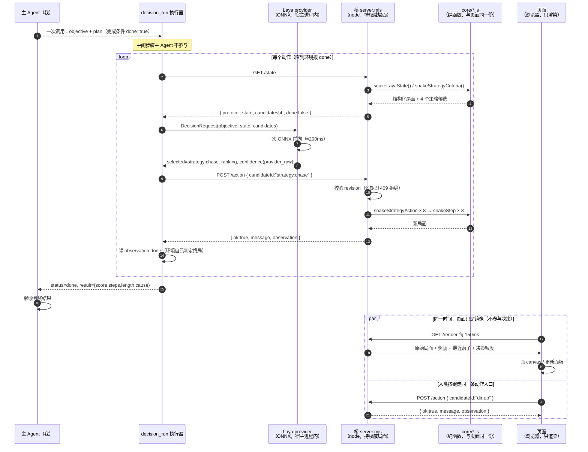
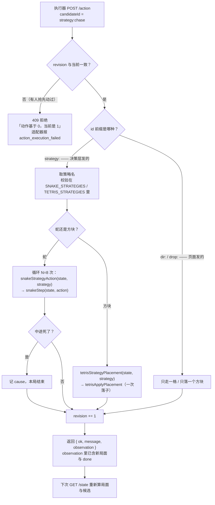
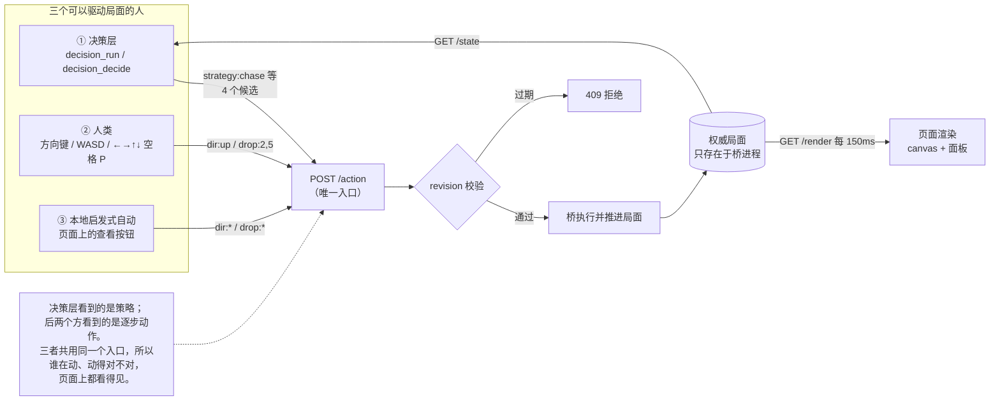

# games/ 时序与流程

三张图：一次接管任务的**全景时序**、一次策略动作的**内部流程**、**三个驱动方**的关系。
全部按当前代码的真实行为画（端点名、`isDone`、`revision` 校验都对得上）。

---

## 图一：全景时序（一次 `decision_run` 接管）

关键点：**主 Agent 只在两头出现**——开头发一次任务，结尾验收。中间每个动作的
"观察 → 决策 → 执行"全由执行器自己转，中间不回来问。

**为什么 `loop` 里不写 `execute: "loop"`**：HTTP 环境自带 `isDone`
（`observation.done === true` → `stopReason: "The environment reports a terminal result."`），
执行器自己就会循环。钻取模式是给"环境说不出自己做完了没有"的场合用的。

---

## 图二：一次策略动作的内部流程

一个动作 = **模型做一个决定**（四选一）+ **本地执行一段**（蛇连走 8 步 / 方块算一个落点）。
这是整个设计里最关键的一处：模型负责决策，确定性代码负责执行。

**注意 `revision` 那道闸**：它挡的是"两个驱动方同时动作"——
决策层观察到局面 N、想了 200ms 再动作时，如果人在这期间按键把局面推到 N+1，
决策层的那个动作就被拒，而不是静默落到已经变了的盘面上。

---

## 图三：三个驱动方与它们各自的动作类型

**三条边界的实际含义：**

| 边界 | 怎么保证的 |
| --- | --- |
| 页面不持状态 | 页面只有 `view`（最近一次 `/render` 的快照），没有任何 `state` 变量 |
| 环境侧不知道 provider | 桥只发候选 id 与局面，**拿不到也拿不到概率/置信度**（接入规范要求如此） |
| 同时只应有一个驱动方 | 桥的 `revision` 守卫只保证"不静默落到过期局面上"；它**不做互斥**——同时驱动仍会互相插队 |

最后一条是已知局限，写在 README 的「局限」里。
