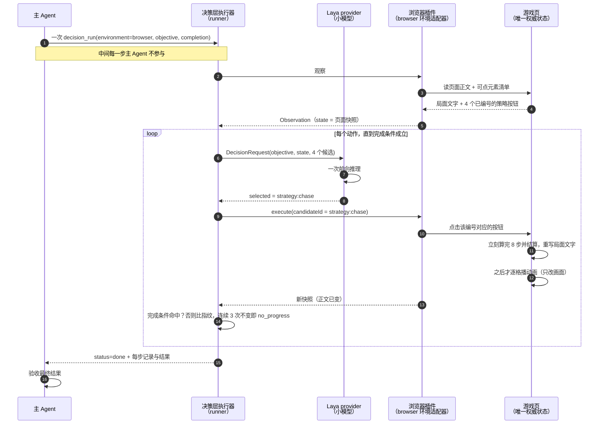
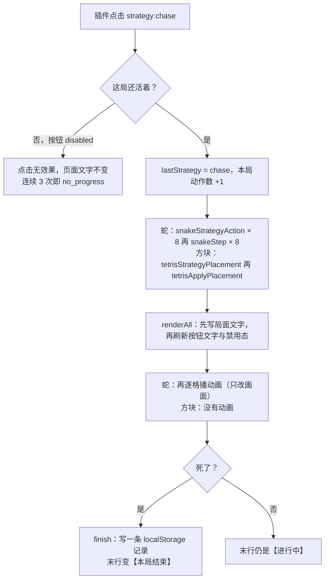

# games/ 时序与失败模式

一次接管任务的**全景时序**、**点一次策略按钮在页面里发生什么**、以及**每一步的判据与失败模式**。

按当前代码的真实行为画：执行器的循环在 `src/runtime/runner.ts`，观察与点击在浏览器适配器
（`src/environments/browser/adapter.ts`），页面侧在 `games/snake.html` / `games/tetris.html`。
`games/README.md` 讲"为什么这么设计"，这里讲"实际怎么跑、哪里会断"。

---

## 图一：全景时序（一次 `decision_run` 接管一局）

关键点：**主 Agent 只在两头出现** —— 开头发一次任务，结尾验收。中间每个动作的
"观察 → 决策 → 执行"全由执行器自己转，不回来问。

**别读成"每步重新打开页面"**：循环里是同一页面的反复快照，页面不刷新。目标页面在开始前就选定了 ——
浏览器插件不会凭目标描述自己去找页面（见 `docs/任务接管协议.md` §1）。

---

## 图二：点一次策略按钮，在页面里发生什么

顺序是这张图里最重要的信息：**先结算、后动画**。动画绝不挡在观察前面 ——
若把结算推迟到动画之后，接管方在"正在执行"的窗口里观察到的是空候选集（按钮被禁用），
实测 Laya 直接报 TopK 维度错误、整局挂掉。

---

## 图三：每一步的判据与失败模式

| 阶段 | 判据 | 失败模式 |
| --- | --- | --- |
| 观察 | 快照正文里有局面文字；候选 = 页面上的可点元素 | 页面还没就绪（`status === 'loading'`）时适配器会额外给 `wait`；快照拿不到或不可用 → `insufficient_observation` |
| 决策 | 从 4 个候选里选 1 个 | 候选为空 → `no_candidates`；选中不存在的 id → `unknown_candidate` |
| 执行 | 按编号点击元素 | 编号指向的节点已不在页面上（DOM 被重建）→ 点击无效，页面文字不变 |
| 结算 | 页面文字立刻变化（文字里带动作数） | 推迟结算 → 接管方看到空候选 → Laya TopK 维度错误 |
| 完成 | `observation.done === true`（浏览器不给），或完成条件命中：`{ path: "main", includes: "【本局结束】" }` | 条件写错 → 跑满 `maxSteps` → `budget_exhausted` |

浏览器/桌面任务**必须**给完成条件（或适配器实现 `isDone()`），否则执行器一开始就以
`invalid_request` 拒掉（`runner.ts` 的守卫）。这两个游戏页没有 `done` 字段，终局只体现为
正文末行的【本局结束】，所以完成条件就是到正文里找它。

---

## `no_progress` 是怎么产生的

`runner.ts` 每个动作之后比对**观察状态的指纹**（`fingerprintState`：`JSON.stringify(state)` 的前
2000 字符）：

- 变了 → `unchangedStreak = 0`；
- 没变 → `unchangedStreak += 1`，累计到 `noProgressLimit`（默认 3）就抛 `no_progress`，
  把控制权交回主 Agent —— **这是升级，不是重试**。

页面文字里带动作数（两页都是 `本局动作数=N`，蛇页另有 `每动作步数=8`）、步数、朝向，所以**每一次真正
生效的点击都会改变指纹**。`no_progress` 因此只在"点了但页面没动"时出现：

1. 编号指向的节点已经不是页面上那个按钮（页面把 DOM 重建过 → 旧编号失效）；
2. 按钮处于 `disabled`（本局已结束）。

这两条正是 README「三件小事」要挡的东西：按钮只建一次、只在死亡时禁用、状态立刻结算。

另外两条守卫要分清：

| 守卫 | 默认 | 对整任务（`decision_run`）是否生效 |
| --- | --- | --- |
| `no_progress` | 3 次状态不变 | **生效**（页面文字不变就是它） |
| `repeated_decision` | 3 次连选同一候选 | **关闭**：整任务路径用 `DEFAULT_TASK_CONFIG` 覆盖成 `0`，注释写明"任务默认允许重复的合法动作"（`runner.ts`） |

第二条很关键：这个模型可能连着十几次都选 `strategy:chase`，那是**合法**的重复动作，
整任务不会因此停下；停下的原因只会是"页面确实不动了"或预算耗尽。

## 为什么现在不会因为 `wait` 卡死

`wait` 是候选集里唯一的 no-op。确定性模型一旦选中它，页面不变 → 快照不变 → 下一步输入完全相同
→ 它还会选 `wait`，三次就撞上 `no_progress`，整局什么都没干就结束。

从 **v0.2.2** 起，浏览器适配器只在文档**还在加载中**（`status === 'loading'`）时才提供 `wait`：
页面就绪后候选集里没有 no-op，这条路是关死的。页面侧不需要为此做任何事 ——
当前行为查 `src/environments/browser/adapter.ts` 的 `#candidatesFor`。

## 三条边界

| 边界 | 怎么保证的 |
| --- | --- |
| 页面是唯一权威状态 | 页面里只有一份 `let state`；没有后端进程、没有第二份演算 |
| 环境侧不认识 provider | 适配器只发页面正文与选中的候选 id，拿不到概率 / 置信度 |
| 同时只应有一个驱动方 | 插件点的是页面上那 4 个真按钮，人类点的也是同一批 —— 页面不做互斥 |
