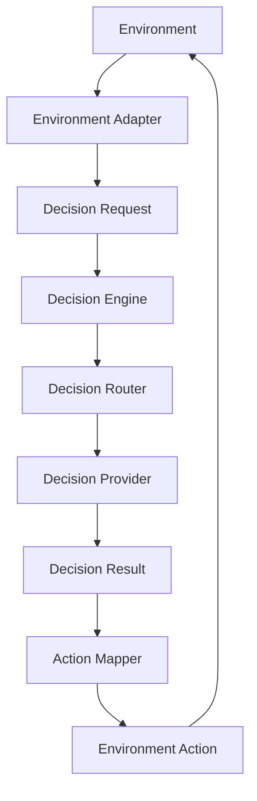

# 任务：设计并实现 DSH 通用 Decision Engine 插件

你现在需要在我的本地 DSH 工作环境中，设计并实现一个独立的 **通用决策引擎插件**。

本项目不是 Laya 专用插件。

Laya 只是当前第一个 Decision Provider，未来可能替换为：

```text
Laya
Jev
其他 ONNX 决策模型
RL Policy
规则引擎
轻量分类模型
未来其他 System-1 模型
```

因此：

> 禁止将 Laya 名称、Laya 专有概念、Laya SDK 结构泄漏到插件公共架构中。

暂定插件名称：

```text
dsh-decision-engine
```

请先审计当前本地环境、DSH 插件机制、Browser / Computer Use 插件接口、已有 Laya 实验代码，再设计并实施。

不要根据本 Prompt 中出现的接口名称直接假设 API 存在。

所有真实实现必须以：

```text
当前本地源码
当前安装版本
当前 DSH Host 接口
```

为准。

如果 Prompt 中的假设与真实源码冲突：

```text
以源码为准，并在最终报告中说明差异。
```

---

# 一、最终目标

我们要实现的是：

> DSH 的通用低延迟 Decision Layer / System-1 Decision Runtime。

它位于：

```text
Browser
Computer Use
Game API
Custom Environment
未来其他 Environment
```

与实际执行动作之间。

整体架构：

```text
Environment
    ↓
Observation
    ↓
Environment Adapter
    ↓
Decision Request
    ↓
Decision Engine
    ↓
Decision Router
    ↓
Decision Provider
    ↓
Decision Result
    ↓
Action Mapper
    ↓
Environment Action
    ↓
Environment
```

具体：

```text
Browser / Computer / Game API
              ↓
      Environment Adapter
              ↓
        Decision Request
              ↓
        Decision Engine
              │
      ┌───────┼────────┐
      ↓       ↓        ↓
    Laya     Jev     Future
 Provider  Provider   Provider
      │       │        │
      └───────┼────────┘
              ↓
        Decision Result
              ↓
         Action Mapper
              ↓
 Browser / Computer / Game
```

---

# 二、核心边界

整个项目必须严格遵守：

```text
Environment
负责：
看

Decision Engine
负责：
决策

Environment
负责：
做
```

更具体：

```text
Browser / Computer / Custom Adapter

负责：
- observe
- 获取结构化环境状态
- 执行 click / key / type / scroll 等真实动作
```

Decision Engine：

```text
负责：
- 接收状态
- 接收有限候选集合
- 选择 / 排序 / 评分
- 返回统一 DecisionResult
```

Decision Provider：

```text
负责：
- 调用具体决策模型
- 将模型私有能力归一化成统一结果
```

Action Mapper：

```text
负责：
- 把抽象 decision 转换成 Browser / Computer / Game action
```

---

# 三、最重要的架构规则

禁止：

```text
BrowserAdapter → Laya
ComputerAdapter → Laya
GameAdapter → Laya
```

必须：

```text
BrowserAdapter
      ↓
DecisionEngine
      ↓
DecisionProvider
```

因此 Browser / Computer / Game 永远不知道当前底层使用的是：

```text
Laya
Jev
RL
规则引擎
其他模型
```

未来：

```text
defaultProvider: laya
```

改成：

```text
defaultProvider: jev
```

时：

> BrowserAdapter / ComputerAdapter / CustomEnvironmentAdapter 不应该需要修改。

---

# 四、当前阶段明确不做视觉

第一阶段明确禁止：

```text
OCR
Vision Model
Screenshot Understanding
Canvas CV
目标检测
图像分类
图片位置理解
```

即使 Computer Use 已经可以截图：

```text
也不要分析截图。
```

第一阶段只处理：

```text
Browser:
DOM / structured text / controls

Computer:
Accessibility Tree / AX Tree

Custom Environment:
显式结构化状态接口
```

如果环境无法提供有效结构化状态：

```text
返回 insufficient_observation
```

不要猜。

---

# 五、现有依赖能力

请实际审计本地安装情况。

重点包括：

## Browser

仓库：

```text
LiuRJ99/dsh-browser
```

预期存在类似：

```text
browser_snapshot
browser_click
browser_type
browser_press
browser_scroll
browser_wait
browser_get_text
browser_navigate
browser_attach_tab
```

但不要假设名称一定完全一致。

必须从源码确认。

Browser 的定位：

```text
Environment Provider
```

它负责：

```text
DOM
页面文字
编号元素
控件
实际 Browser action
```

第一阶段支持：

```text
普通 Web UI
表单
菜单
流程页
按钮状态
列表
状态机式页面
```

不支持：

```text
只有 canvas
只有 video
纯 WebGL
DOM 几乎为空
```

出现这些情况：

```text
insufficient_observation
```

---

## Computer Use

仓库：

```text
LiuRJ99/dsh-computer-use
```

预期存在：

```text
computer_use_list_apps
computer_use_get_app_state
computer_use_click
computer_use_type_text
computer_use_press_key
computer_use_scroll
computer_use_set_value
computer_use_drag
```

同样：

```text
必须检查真实源码。
```

第一阶段只使用：

```text
Accessibility Tree
AX element index
结构化 UI 信息
```

禁止依赖截图判断。

如果 AX Tree 只有：

```text
AXGroup
AXGroup
AXGroup
```

或者无法表达当前任务：

```text
insufficient_observation
```

---

## Lazy Gate

检查：

```text
dsh-tool-lazy-gate
```

当前 Browser / Computer 的会话授权机制。

必须保持：

```text
Browser / Computer 权限属于现有能力体系。
```

Decision Engine 不能绕过权限。

如果当前会话没有启用：

```text
/browser
```

则 Browser Environment 不可执行。

如果没有启用：

```text
/computer-use
```

则 Computer Environment 不可执行。

Decision Engine 本身可以加载。

但：

```text
Decision Engine != 权限提升工具
```

---

# 六、已有 Laya 实验项目

如果当前 workspace 中存在：

```text
laya-router-game
```

或者类似实验项目：

首先审计。

重点分析：

```text
Laya provider 初始化方式
Laya SDK
ONNX Runtime 使用方式
choice
score
noul
strategy mode
environment card
facts
criteria
preview
reward
heuristic
```

区分：

```text
可进入通用 Provider 的部分
```

与：

```text
Snake / Tetris 专属逻辑
```

不要继续在：

```text
laya-router-game
```

中堆 Browser / Computer 功能。

旧项目应该降级成：

```text
example
demo
integration test
custom environment adapter example
```

核心能力独立成：

```text
dsh-decision-engine
```

---

# 七、Decision Provider 抽象

这是本次最关键接口之一。

设计统一：

```ts
interface DecisionProvider {
  id: string

  capabilities: DecisionCapability[]

  decide(
    request: DecisionRequest,
    context?: DecisionContext
  ): Promise<DecisionResult>

  healthCheck?(): Promise<ProviderHealth>
}
```

具体接口可以根据实际 TypeScript / DSH 结构调整。

但原则不能变。

Provider 是：

```text
可插拔
可替换
可关闭
可路由
```

---

# 八、Decision Capability

建议抽象：

```ts
type DecisionCapability =
  | "choice"
  | "ranking"
  | "score"
  | "classification"
```

不要把：

```text
noul
```

作为公共 Capability。

因为：

```text
noul
```

属于 Laya 私有概念。

Laya Provider 内部可以：

```text
noul
→ classification
```

或者：

```text
noul
→ action_needed
```

但 Core 不应该知道 noul。

---

# 九、当前第一个 Provider：Laya

实现：

```text
LayaDecisionProvider
```

它负责封装：

```text
Laya SDK
ONNX
choice
score
noul
```

所有 Laya 私有逻辑只能存在于：

```text
providers/laya/
```

例如：

```text
providers/
└── laya/
    ├── provider.ts
    ├── runtime.ts
    ├── choice.ts
    ├── score.ts
    ├── classification.ts
    └── config.ts
```

Core 禁止：

```text
import laya
```

BrowserAdapter 禁止：

```text
import LayaProvider
```

ComputerAdapter 禁止：

```text
import LayaProvider
```

所有调用只能通过：

```text
DecisionProvider interface
```

---

# 十、Decision Request

设计模型无关协议。

概念类似：

```ts
interface DecisionRequest {
  objective?: string

  state:
    | string
    | Record<string, unknown>

  candidates: DecisionCandidate[]

  constraints?: string[]

  mode?:
    | "choice"
    | "ranking"
    | "score"
    | "classification"

  metadata?: Record<string, unknown>
}
```

Candidate：

```ts
interface DecisionCandidate {
  id: string
  description: string
  metadata?: Record<string, unknown>
}
```

要求：

```text
candidate id 必须稳定
candidate 数量有限
禁止让模型自由生成 action
```

---

# 十一、Decision Result

统一响应类似：

```ts
interface DecisionResult {
  provider: string

  selected?: string

  ranking?: Array<{
    id: string
    score?: number
  }>

  confidence?: number

  latencyMs?: number

  metadata?: Record<string, unknown>
}
```

要求：

```text
Provider-specific raw result
不能污染 Core API
```

如果确实要保留 raw：

```text
仅放在 debug / providerMetadata
```

不能让上层依赖它。

---

# 十二、Decision Engine

实现统一：

```text
decisionEngine.decide(request)
```

概念：

```ts
const result = await decisionEngine.decide({
  state,
  candidates,
  objective
})
```

上层不应该：

```text
new Laya()
```

也不应该：

```text
laya.choice(...)
```

---

# 十三、Decision Router

第一版可以简单。

至少支持：

```text
defaultProvider
```

例如：

```yaml
decisionEngine:
  defaultProvider: laya
```

但架构必须支持未来：

```yaml
decisionEngine:
  providers:
    laya:
      enabled: true

    jev:
      enabled: true

  routing:
    default: laya
```

后期可扩展：

```text
candidate_count
task_type
latency requirement
provider capability
confidence
```

例如未来：

```text
简单有限选择
→ laya

复杂 ranking
→ jev

低 confidence
→ main agent
```

但第一版不要过度实现复杂 Router。

只要：

```text
Provider Registry
Default Provider
Optional Explicit Provider
```

即可。

---

# 十四、Environment Protocol

Environment 与 Decision Engine 必须解耦。

设计统一接口。

概念类似：

```ts
interface EnvironmentAdapter {
  id: string

  observe(): Promise<Observation>

  buildDecisionRequest(
    observation: Observation,
    objective: Objective
  ): Promise<DecisionRequest>

  mapDecision(
    result: DecisionResult,
    observation: Observation
  ): Promise<EnvironmentAction>

  execute(
    action: EnvironmentAction
  ): Promise<ActionResult>

  isDone?(
    observation: Observation,
    objective: Objective
  ): Promise<boolean> | boolean
}
```

实际接口可调整。

---

# 十五、Observation

统一 Observation。

例如：

```ts
interface Observation {
  status:
    | "ok"
    | "insufficient"
    | "unsupported"
    | "error"

  source:
    | "browser"
    | "computer"
    | "custom"

  state?: unknown

  actions?: unknown[]

  reason?: string

  metadata?: Record<string, unknown>
}
```

重点：

```text
insufficient
```

必须是一等状态。

不能把：

```text
看不懂
```

转成：

```text
猜一下
```

---

# 十六、Browser Environment Adapter

实现：

```text
BrowserEnvironmentAdapter
```

职责：

```text
调用 Browser 能力获取页面结构
↓
解析当前环境
↓
生成 DecisionRequest
↓
接收 DecisionResult
↓
映射为 Browser action
```

例如：

```text
Objective:
完成当前页面流程。

State:
用户名和密码已经填写。

Candidates:

submit
提交当前表单

edit
继续编辑

wait
等待页面变化
```

Decision Engine 返回：

```text
submit
```

Adapter：

```text
submit
→ browser_click(loginButtonRef)
```

Decision Engine 不知道：

```text
loginButtonRef
```

---

# 十七、Browser Adapter 支持范围

第一阶段明确支持：

```text
按钮
链接
输入框
checkbox
radio
列表
菜单
分页
表单流程
状态提示
普通网页任务
```

发现：

```text
Canvas
WebGL
Video
不可读 iframe
几乎没有文本或 controls
```

则：

```text
Observation.status = insufficient
```

然后：

```text
escalate
```

---

# 十八、Computer Environment Adapter

实现：

```text
ComputerEnvironmentAdapter
```

数据源：

```text
AX Tree
```

例如：

```text
[1] AXWindow Download
  [2] AXStaticText "Download complete"
  [3] AXButton "Open"
  [4] AXButton "Show in Finder"
  [5] AXButton "Close"
```

转换：

```text
Objective:
打开下载完成的文件。

State:
文件已经下载完成。

Candidates:

open
reveal
close
wait
```

Decision：

```text
open
```

映射：

```text
open
→ computer_use_click(index=3)
```

---

# 十九、Computer Adapter 不允许做的事情

禁止：

```text
读取 screenshot 后分析
OCR
CV
坐标推测
通过图像猜按钮
```

如果 AX Tree 不足：

```text
escalate
```

---

# 二十、Custom Environment

支持第三类：

```text
CustomEnvironmentAdapter
```

用于：

```text
游戏
内部业务系统
设备控制
模拟器
自定义 API
```

例如游戏可以提供：

```json
{
  "score": 100,
  "health": 60,
  "enemyHealth": 30,
  "availableActions": [
    "attack",
    "defend",
    "heal"
  ]
}
```

转换：

```text
Game API
↓
Custom Environment Adapter
↓
Decision Request
↓
Decision Engine
↓
Decision Provider
↓
Decision Result
↓
Action Mapper
↓
Game API
```

---

# 二十一、不要让每个游戏直接适配 Laya

禁止：

```text
SnakeLayaAPI
TetrisLayaAPI
RacingLayaAPI
```

应该：

```text
SnakeAdapter
TetrisAdapter
RacingAdapter
```

全部实现：

```text
EnvironmentAdapter
```

它们完全不知道：

```text
Laya
```

当前使用 Laya：

```text
Environment
↓
DecisionEngine
↓
LayaProvider
```

未来使用其他模型：

```text
Environment
↓
DecisionEngine
↓
OtherProvider
```

Environment 不变。

---

# 二十二、Action 与 Decision 分离

禁止让 Decision Provider 输出：

```json
{
  "tool": "browser_click",
  "args": {
    "element": 17
  }
}
```

Decision 只能返回：

```json
{
  "selected": "submit"
}
```

映射由 Adapter 完成：

```text
submit
→ browser_click(17)
```

或者：

```text
attack
→ computer_use_press_key("Space")
```

或者：

```text
attack
→ customGame.attack()
```

这样：

```text
Decision Model
```

完全不绑定：

```text
Tool Schema
```

---

# 二十三、有限候选原则

Decision Engine 不是生成式 Agent。

禁止：

```text
“告诉我下一步应该怎么办”
```

应该：

```text
当前状态：
...

目标：
...

Candidates:

continue
retry
wait
abort
```

然后选择。

所有 Decision Provider 都应优先工作于：

```text
有限 action space
```

---

# 二十四、主 Agent 与 Decision Engine 分工

主 Agent：

```text
负责：
- 理解用户目标
- 复杂规划
- 初始化 Environment
- 定义抽象策略
- 未知状态处理
- 异常恢复
- 高风险决策
```

Decision Engine：

```text
负责：
- 高频
- 低延迟
- 有限候选
- 重复状态下的快速决策
```

例如：

```text
主 Agent

Objective:
推进当前工作流直到成功。

Strategies:
continue
retry
wait
abort
```

之后重复决策可以交给 Decision Engine。

---

# 二十五、Fallback / Escalation

必须定义统一 escalation contract。

以下情况必须退出 Decision Engine 流程并交回主 Agent：

```text
1. observation 不足
2. environment unsupported
3. 没有候选项
4. provider 不支持请求 mode
5. provider unavailable
6. confidence 太低
7. 返回 candidate 不存在
8. action mapping 失败
9. action execution 失败
10. 状态连续不变化
11. 连续重复相同 action
12. 出现未知 UI 状态
13. 需要视觉理解
14. 需要 OCR
15. 需要复杂规划
16. 高风险动作
```

统一响应类似：

```json
{
  "status": "needs_escalation",
  "reason": "insufficient_observation",
  "environment": "computer",
  "provider": "laya",
  "lastDecision": null
}
```

---

# 二十六、执行模式

不要直接做无限自动驾驶。

分阶段。

---

## Phase 1：Decision Only

流程：

```text
observe
↓
build DecisionRequest
↓
Decision Engine
↓
map decision
↓
返回 action preview
```

但：

```text
不执行
```

输出例如：

```text
Decision:
submit

Confidence:
0.84

Mapped Action:
browser_click(ref=17)
```

---

## Phase 2：Single-Step Execute

允许：

```text
observe
↓
decide
↓
validate
↓
execute ONE action
↓
observe
↓
return
```

一次 invocation：

```text
最多一个 Decision Action
```

---

## Phase 3：Bounded Loop

确认稳定后：

```ts
for step < maxSteps:
    observe()
    decide()
    validate()
    execute()
    verify()
```

必须包含：

```text
maxSteps
maxDuration
abort signal
confidence threshold
repeated state detection
no progress detection
action repetition detection
```

禁止：

```text
while(true)
```

如果时间有限：

```text
优先完成 Phase 1 + Phase 2。
```

---

# 二十七、公共工具命名

公共 API 不能出现：

```text
laya_choose
laya_score
laya_noul
```

建议优先考虑：

```text
decision_decide
```

必要时：

```text
decision_score
```

但：

```text
公共工具越少越好。
```

优先统一：

```text
decision_decide
```

参数：

```json
{
  "objective": "...",
  "state": "...",
  "candidates": [],
  "mode": "choice",
  "provider": "laya"
}
```

其中：

```text
provider
```

应为可选。

不传：

```text
使用 defaultProvider。
```

---

# 二十八、Skill / Workflow

评估实现：

```text
/decision
```

或者更合适的通用 skill。

不要叫：

```text
/laya
```

除非它只是调试某个 Provider 的开发专用 Skill。

正式工作流必须使用模型无关名称。

例如：

```text
/decision-control
```

后续它可以控制：

```text
browser
computer
custom environment
```

---

# 二十九、Provider Registry

实现类似：

```text
DecisionProviderRegistry
```

负责：

```text
register
get
list
capability check
health
default provider
```

概念：

```ts
registry.register(layaProvider)

registry.get("laya")

registry.getDefault()
```

未来：

```ts
registry.register(jevProvider)
```

Core 无需修改。

---

# 三十、Provider 配置

建议：

```yaml
decisionEngine:
  enabled: true

  defaultProvider: laya

  providers:
    laya:
      enabled: true

  runtime:
    confidenceThreshold: 0.55
    maxSteps: 10
    noProgressLimit: 3

  browser:
    enabled: true

  computer:
    enabled: true
```

Laya 私有配置必须放：

```yaml
providers:
  laya:
```

例如：

```yaml
providers:
  laya:
    modelPath: ...
    device: cpu
```

而不能：

```yaml
decisionEngine:
  layaModelPath: ...
```

这样未来可以：

```yaml
providers:
  jev:
```

---

# 三十一、建议项目结构

先依据真实 DSH 插件规范验证。

概念结构：

```text
dsh-decision-engine/
│
├── package.json
├── cordis.patch.yml
│
├── src/
│   │
│   ├── core/
│   │   ├── decision-engine.ts
│   │   ├── provider-registry.ts
│   │   ├── router.ts
│   │   └── types.ts
│   │
│   ├── providers/
│   │   ├── types.ts
│   │   │
│   │   └── laya/
│   │       ├── provider.ts
│   │       ├── runtime.ts
│   │       ├── choice.ts
│   │       ├── score.ts
│   │       ├── classification.ts
│   │       └── config.ts
│   │
│   ├── environments/
│   │   ├── types.ts
│   │   ├── browser/
│   │   │   └── adapter.ts
│   │   ├── computer/
│   │   │   └── adapter.ts
│   │   └── custom/
│   │       └── adapter.ts
│   │
│   ├── runtime/
│   │   ├── observe.ts
│   │   ├── decide.ts
│   │   ├── map-action.ts
│   │   ├── execute.ts
│   │   ├── verify.ts
│   │   └── escalation.ts
│   │
│   ├── tools/
│   │   └── decision-decide.ts
│   │
│   └── index.ts
│
├── skills/
│   └── decision-control/
│
├── examples/
│   ├── browser/
│   ├── computer/
│   └── custom-game/
│
└── test/
```

不要机械照抄。

如果 DSH 官方插件结构明显有更好的方式：

```text
以当前 DSH 插件范式为准。
```

---

# 三十二、依赖原则

优先依赖：

```text
DSH public service seam
capability interface
tool registry
tool dispatch
public plugin contract
```

不要：

```text
import browser plugin internal file
import computer plugin internal file
```

禁止直接引用：

```text
node_modules/.../internal
```

目标：

> Browser / Computer 升级时 Decision Engine 尽量不受影响。

---

# 三十三、Browser / Computer Service Seam 审计

Phase 0 必须明确回答：

```text
Browser 是否存在 stable service seam？
Computer 是否存在 stable service seam？
```

如果有：

```text
优先 service injection。
```

如果没有：

评估：

```text
DSH tool dispatch
```

作为集成方法。

不要为了 Decision Engine：

```text
修改 Browser 核心插件
修改 Computer 核心插件
```

除非确实缺少必要公共接口。

如果必须修改：

```text
先说明原因
最小修改
公共契约
单独提交
```

---

# 三十四、Lazy Gate

必须遵守现有 capability gate。

Decision Engine 不拥有：

```text
browser permission
computer permission
```

Environment 调用前必须确认能力可用。

不能：

```text
绕过 Lazy Gate
```

也不要：

```text
复制 Lazy Gate。
```

权限链：

```text
User
↓
Browser / Computer Skill Authorization
↓
Lazy Gate
↓
Environment Adapter
↓
Decision Engine
```

---

# 三十五、游戏 Adapter

把现有：

```text
Snake
或
Tetris
```

其中一个改造成：

```text
CustomEnvironmentAdapter
```

作为证明。

目标不是优化游戏策略。

目标是证明：

```text
游戏 Adapter
↓
Decision Engine
↓
Laya Provider
```

可以工作。

而且未来：

```text
换 Provider
```

游戏 Adapter 不需要改变。

---

# 三十六、不要做的事情

第一版明确禁止：

```text
❌ Vision
❌ OCR
❌ Screenshot Understanding
❌ Canvas CV
❌ 目标检测
❌ Playwright 新实现
❌ 重写 Browser
❌ 重写 Computer Use
❌ 自己造 mouse/keyboard driver
❌ 复制 Lazy Gate
❌ 写死 Laya
❌ 公共 API 出现 noul
❌ BrowserAdapter import LayaProvider
❌ ComputerAdapter import LayaProvider
❌ 为每个游戏做独立 Provider
❌ Decision Provider 输出 raw tool calls
❌ Decision Provider 自由生成 action
❌ 无限循环
```

---

# 三十七、测试

至少完成以下测试。

---

## A. Core Unit Tests

```text
Provider registration
Default provider
Explicit provider selection
Unknown provider
Capability validation
Invalid candidates
Empty candidates
Decision normalization
Invalid selected id
Confidence threshold
Provider error
Provider timeout
```

---

## B. Laya Provider Tests

```text
choice
score
noul → generic classification mapping
invalid output
model unavailable
latency recording
```

验证：

```text
Laya 专有能力没有泄漏到 Core。
```

---

## C. Environment Tests

```text
Browser Observation
Computer Observation
Custom Observation
insufficient observation
unsupported environment
action mapping
```

---

## D. Browser Integration Test

创建简单本地 HTML：

```text
State A

[Continue]

↓

State B

[Finish]

↓

Success
```

验证：

```text
Browser
↓
Observation
↓
DecisionRequest
↓
DecisionEngine
↓
LayaProvider
↓
DecisionResult
↓
Browser Action
```

整个流程：

```text
不使用截图。
```

---

## E. Computer Integration Test

如果机器允许：

使用安全的简单应用测试。

验证：

```text
AX Tree
↓
Observation
↓
DecisionEngine
↓
Action Mapping
↓
Computer Action
```

不要修改重要系统配置。

如果 CI 无法跑真实 Computer Use：

```text
FakeComputerEnvironment
```

并提供：

```text
manual integration test
```

---

## F. Custom Game Test

从现有：

```text
Snake
Tetris
```

选一个。

重构成：

```text
EnvironmentAdapter
```

验证：

```text
Game State
↓
Decision Engine
↓
Laya Provider
↓
Abstract Decision
↓
Game Action
```

---

# 三十八、Telemetry

加入轻量 telemetry。

建议：

```text
environment
provider
mode
candidate_count

observe_ms
decision_ms
map_ms
execute_ms
total_ms

confidence
selected

step_count
escalation_reason
```

不要默认持久化：

```text
完整 DOM
完整 AX Tree
密码
token
用户隐私
敏感表单
```

---

# 三十九、性能目标

Decision Engine 的价值是：

```text
低延迟
低资源
有限候选
可重复
高频快速调用
```

因此必须分别测：

```text
Provider latency
Environment latency
Total latency
```

不要把：

```text
Browser 加载慢
```

误认为：

```text
Decision Model 慢。
```

---

# 四十、错误模型

定义统一 Error / Escalation 类型。

例如：

```text
ProviderUnavailable
ProviderUnsupportedCapability
InvalidDecision
LowConfidence
ObservationInsufficient
EnvironmentUnsupported
ActionMappingFailed
ActionExecutionFailed
NoProgress
RepeatedDecision
Timeout
Aborted
```

不要到处：

```text
throw new Error("failed")
```

---

# 四十一、Phase 0：审计

实施前先完成真实审计。

必须输出：

```text
1. DSH Host 当前版本
2. Node / pnpm 版本
3. Browser 插件版本
4. Computer Use 插件版本
5. Lazy Gate 版本
6. 当前 Laya 实验项目位置
7. Laya SDK / runtime / model 加载方式
8. Browser public seam
9. Computer public seam
10. Tool dispatch 能力
11. Skill 注册方式
12. Bundle / cordis patch 机制
13. 可复用代码
14. 不应该复用的 demo-specific 代码
15. 当前可能存在的架构风险
```

不要只给报告。

审计完成后：

> 如果没有阻塞性问题，继续实施。

不要停下来等确认。

---

# 四十二、Phase 1：架构落地

先完成：

```text
DecisionProvider
DecisionProviderRegistry
DecisionRequest
DecisionResult
DecisionEngine
Observation
EnvironmentAdapter
EscalationResult
```

先让 Core：

```text
不依赖 Browser
不依赖 Computer
不依赖 Laya
```

---

# 四十三、Phase 2：Laya Provider

把现有 Laya 实验抽出来：

```text
LayaDecisionProvider
```

封装：

```text
choice
score
noul
runtime
model initialization
```

保证：

```text
删除 providers/laya
```

理论上 Core 仍可编译。

如果做不到：

```text
说明 Core 仍然耦合。
```

必须修。

---

# 四十四、Phase 3：Decision Tool

实现公共工具：

```text
decision_decide
```

最小测试：

```json
{
  "objective": "选择下一步",
  "state": "任务已经完成下载",
  "candidates": [
    {
      "id": "open",
      "description": "打开文件"
    },
    {
      "id": "wait",
      "description": "继续等待"
    }
  ]
}
```

返回统一结果。

---

# 四十五、Phase 4：Browser Environment

完成：

```text
Browser Observe
↓
DecisionRequest
↓
DecisionEngine
↓
Mapped Action
```

至少支持：

```text
Decision Only
Single Step
```

---

# 四十六、Phase 5：Computer Environment

完成：

```text
AX Tree
↓
DecisionRequest
↓
DecisionEngine
↓
Mapped Action
```

仍然：

```text
禁止 screenshot understanding。
```

---

# 四十七、Phase 6：Custom Game Demo

把 Snake / Tetris 其中一个：

```text
改成 Environment Adapter。
```

不要直接复制整个旧项目。

只提取：

```text
state
candidates
action mapping
```

---

# 四十八、Phase 7：Bounded Runtime

如果前面稳定：

实现：

```text
single-step runner
```

再评估：

```text
bounded loop
```

必须有：

```text
maxSteps
maxDuration
abort
low confidence escalation
no progress detection
repeat detection
```

---

# 四十九、Git / 工程规范

必须遵循：

```text
Correctness
Verifiability
Minimal Assumptions
Reuse
Executable Design
Explicit Uncertainty
```

要求：

```text
TypeScript strict
不 hand-edit node_modules
不复制 lockfile 到其他 profile
不写机器绝对路径
不提交 credential
不提交 token
不提交模型私密凭据
关键逻辑测试
公共接口尽量小
```

每个关键修改：

```text
尽量独立 commit。
```

---

# 五十、升级兼容性

重点考虑：

```text
Browser
Computer
DSH Host
```

后续会升级。

因此：

```text
依赖 public contract
```

而不是实现细节。

如果不得不依赖 unstable API：

最终报告中明确：

```text
unstable dependency
impact
mitigation
```

---

# 五十一、验收标准

最终必须满足：

## A

存在独立：

```text
dsh-decision-engine
```

而不是：

```text
dsh-laya
```

---

## B

Laya 只是：

```text
DecisionProvider
```

---

## C

Core 中不存在：

```text
Laya-specific API
noul
Laya SDK
```

---

## D

Browser：

```text
Browser Environment
↓
Decision Engine
↓
Provider
```

可以完成至少一个结构化页面单步决策。

---

## E

Computer：

```text
AX
↓
Decision Engine
↓
Provider
```

可以完成至少一个结构化 UI 单步决策。

---

## F

信息不足时：

```text
escalation
```

而不是猜。

---

## G

Custom Game：

```text
Snake / Tetris Adapter
```

其中一个可以工作。

---

## H

更换 Provider 不需要修改：

```text
BrowserAdapter
ComputerAdapter
CustomEnvironmentAdapter
```

---

## I

Browser / Computer 权限：

```text
继续受现有 Lazy Gate 管理。
```

---

## J

不存在：

```text
Decision Provider
→ raw browser/computer tool call
```

---

# 五十二、最终报告

实施结束后必须输出：

## 1. 状态

```text
成功
部分成功
阻塞
```

以及原因。

---

## 2. 审计结果

列出真实：

```text
DSH
Browser
Computer
Lazy Gate
Laya
```

版本及接口。

---

## 3. 最终架构

必须给 Mermaid：



并扩展展示：

```text
Browser
Computer
Custom Game

以及：

Laya
Future Provider
```

---

## 4. 文件变更

逐项列：

```text
新增
修改
删除
```

说明用途。

---

## 5. 公共接口

列：

```text
services
tools
skills
config
provider interface
environment interface
```

---

## 6. Laya Provider

说明：

```text
哪些 Laya 特性被封装
如何归一化
noul 如何映射
```

---

## 7. Browser 集成

说明：

```text
使用了什么 public contract
是否存在 unstable dependency
```

---

## 8. Computer 集成

同上。

---

## 9. Lazy Gate

说明：

```text
Decision Engine 如何遵守权限边界。
```

---

## 10. 测试

列：

```text
测试命令
通过数量
失败数量
integration result
```

---

## 11. 性能

输出：

```text
decision latency
environment latency
total latency
```

至少给出一次真实测试数据。

---

## 12. 失败与限制

明确：

```text
Vision 未实现
OCR 未实现
Canvas 无结构化状态时不支持
AX 信息不足时不支持
复杂规划交回主 Agent
```

---

## 13. Provider 替换验证

必须说明：

假设未来新增：

```text
JevDecisionProvider
```

需要修改哪些文件。

理想答案应该接近：

```text
新增 provider
注册 provider
增加 config
```

而不应该需要：

```text
修改 BrowserAdapter
修改 ComputerAdapter
修改 Environment Protocol
```

---

## 14. 使用示例

至少给出：

```text
decision_decide

Browser Decision

Computer Decision

Custom Game Decision
```

四个示例。

---

# 五十三、最后一个架构自检

完成代码后，请主动检查以下问题：

```text
如果现在删除 Laya Provider，
Core 是否还能存在？
```

如果答案：

```text
不能
```

说明架构失败。

再检查：

```text
如果新增第二个 Decision Provider，
是否需要修改 Browser Adapter？
```

如果答案：

```text
需要
```

说明架构失败。

再检查：

```text
如果 Browser 插件升级，
是否只要 public contract 不变，
Decision Engine 就无需修改？
```

如果答案：

```text
不是
```

检查是否依赖了内部实现。

再检查：

```text
DecisionProvider 是否知道 browser_click？
```

如果答案：

```text
知道
```

说明层级泄漏，必须修正。

---

# 核心原则总结

整个实现始终遵守：

```text
Environment = 看 + 做

Decision Engine = 调度决策

Decision Provider = 如何决策

Laya = 当前一个 Provider
```

不是：

```text
Laya 控制 Browser
Laya 控制 Computer
Laya 控制游戏
```

而是：

```text
Browser / Computer / Game
        ↓
Environment Adapter
        ↓
Decision Engine
        ↓
当前 Provider
        ↓
Decision Result
        ↓
Environment Adapter
        ↓
Browser / Computer / Game
```

这次真正要实现的是：

> 一个未来可以替换决策模型、扩展决策模型、路由多个决策模型，而不影响 Browser / Computer / Game Environment 的通用 DSH Decision Engine。

请从 Phase 0 审计开始。

完成审计后，如果没有真实阻塞：

> 不要停下来询问确认，直接继续实现、测试、修复，直到达到当前环境下可实现的最高完成度。

如果遇到无法解决的真实阻塞：

```text
明确说明：
事实
证据
影响
已经尝试的方案
最小解决方案
```

禁止猜测。
